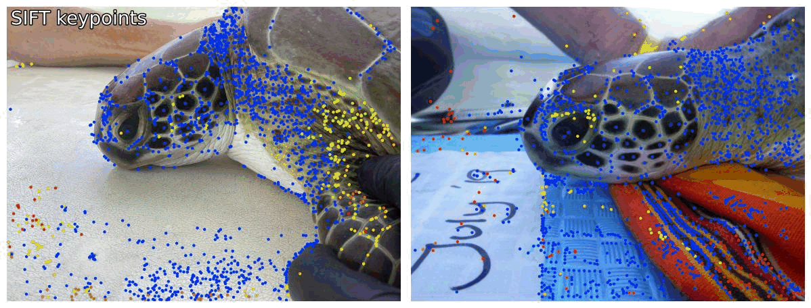

# Marcus' GitHub page

## Who am I
I'm a Data Scientist with a strong background and interest in the life sciences. I currently work for [MetaCell](www.metacell.us) as a data scientist where I've worked on projects ranging from MRI processing all the way through to bioinformatics. Prior to that I was an Assistant Professor at Kyushu University.

In my spare time I also volunteer as an AI Engineer for [FruitPunch AI](https://www.fruitpunch.ai/) where I work on a whole range of interesting projects. Including facial recognitions for Sea Turtles

To see more of my work check out my portfolio repository: https://github.com/mleiwe/DataSciencePortfolio

## Academic Papers
* [Automated neuronal reconstruction with super-multicolour Tetbow labelling and threshold-based clustering of colour hues](https://pubmed.ncbi.nlm.nih.gov/38918382/). Nat Commun. 2024 Jun 25;15(1):5279. doi: 10.1038/s41467-024-49455-y

    **Leiwe MN**, Fujimoto S, Baba T, Moriyasu D, Saha B, Sakaguchi R, Inagaki S, Imai T.
    
    

* [Effective Hand Rearing of Neonatal Mice for Developmental Studies](https://pubmed.ncbi.nlm.nih.gov/37323632/). Bio Protoc. 2023 Jun 5;13(11):e4755. doi: 10.21769/BioProtoc.4755. eCollection 2023 Jun 5.

    **Leiwe MN**, Fujimoto S, Imai T.

* [Activity-dependent local protection and lateral inhibition control synaptic competition in developing mitral cells in mice](https://pubmed.ncbi.nlm.nih.gov/37290446/). Dev Cell. 2023 Jul 24;58(14):1221-1236.e7. doi: 10.1016/j.devcel.2023.05.004. Epub 2023 Jun 7.

    Fujimoto S, **Leiwe MN**, Aihara S, Sakaguchi R, Muroyama Y, Kobayakawa R, Kobayakawa K, Saito T, Imai T.

* [Post hoc Correction of Chromatic Aberrations in Large-Scale Volumetric Images in Confocal Microscopy](https://pubmed.ncbi.nlm.nih.gov/34955764/). Front Neuroanat. 2021 Dec 10;15:760063. doi: 10.3389/fnana.2021.760063. eCollection 2021.

    **Leiwe MN**, Fujimoto S, Imai T.

* [Bright multicolor labeling of neuronal circuits with fluorescent proteins and chemical tags](https://pubmed.ncbi.nlm.nih.gov/30454553/). Elife. 2018 Nov 20;7:e40350. doi: 10.7554/eLife.40350.
    
    Sakaguchi R, **Leiwe MN**, Imai T.
* [In vivo two-photon imaging of the embryonic cortex reveals spontaneous ketamine-sensitive calcium activity](https://pubmed.ncbi.nlm.nih.gov/30375447/). Sci Rep. 2018 Oct 30;8(1):16059. doi: 10.1038/s41598-018-34410-x.
    
    Yuryev M, Andriichuk L, **Leiwe M**, Jokinen V, Carabalona A, Rivera C.

* [Geniculo-Cortical Projection Diversity Revealed within the Mouse Visual Thalamus](https://pubmed.ncbi.nlm.nih.gov/26727264/). PLoS One. 2016 Jan 4;11(1):e0144846. doi: 10.1371/journal.pone.0144846. eCollection 2016.

    **Leiwe MN**, Hendry AC, Bard AD, Eglen SJ, Lowe AS, Thompson ID.
