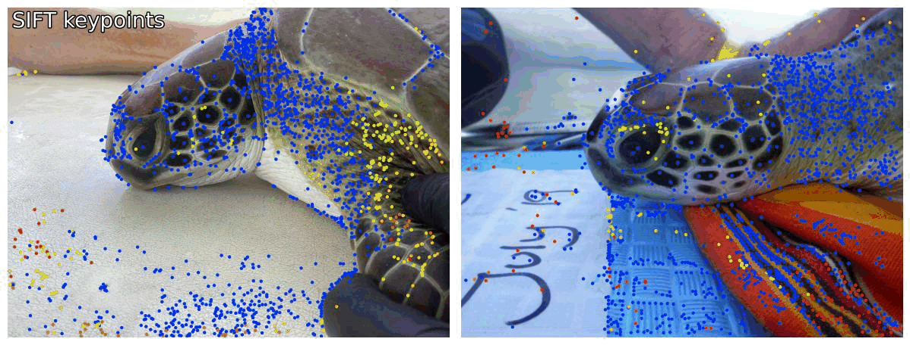

# Marcus' GitHub page

## Who am I
I'm a Data Scientist with a strong background and interest in the life sciences. I currently lead a data and AI consultancy - [Leiwe and Partners](https://leiwe.partners) where I've worked on projects ranging from MRI processing, bioinformatics, feature matching, ontology creation, and graph networks. I occaisionally still moonlight as a senior data scientist at [MetaCell](www.metacell.us).

In my spare time I also volunteer as an AI Engineer for [FruitPunch AI](https://www.fruitpunch.ai/) where I work on a whole range of interesting projects. Including facial recognitions for Sea Turtles (see below) and am an organiser at the Hong Kong chapter of [AI Tinkerers](https://aitinkerers.org/)

## Background
I have a PhD in Neuroscience from King's College London. It was at King's that I first started to code, being given a copy of MATLAB with a bunch of confocal images and being tasked to extract the intensity of synaptic puncta. Throughout my academic work I've always tinkerered in code using it for image processing, time-series analysis, exploratory data analysis, and even building interfaces for experimental machines such as olfactometers.

Mostly I now use these problem solving skills to help commercial clients but if you have an interesting academic question feel free to drop me a message.

## Useful Links

[LinkedIn](https://www.linkedin.com/in/marcus-leiwe/) | [Twitter/X](https://x.com/marcusleiwe) | [Portfolio](https://github.com/mleiwe/DataSciencePortfolio) | [Publications](https://scholar.google.com/citations?user=RFhan0YAAAAJ&hl=en)
